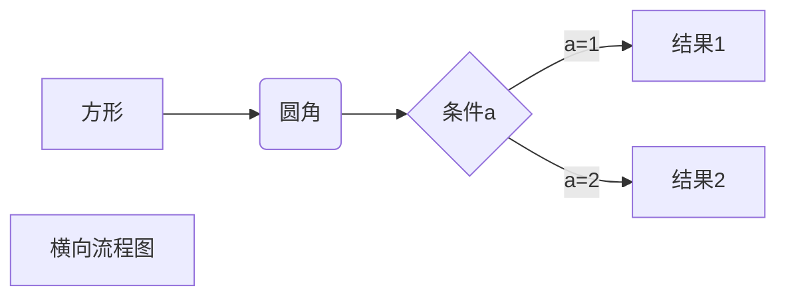
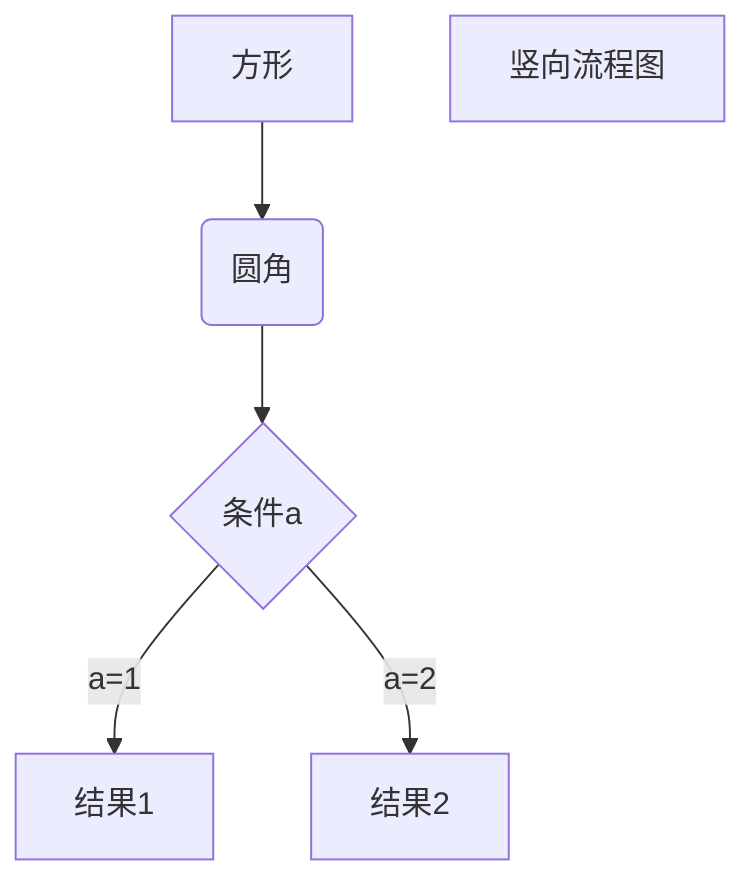

#一级标题
##二级标题
###三级标题
####四级标题
#####五级标题
######六级标题
***
***
***
***
***


这是一段段落  

这是第二段

*斜体*
**粗体**
***斜粗体***
~~hello world~~
<u>hello world</u>
==标记文本==
H~2~O is是液体
2^10^ 运算结果是 1024
创建脚注格式类似这样[^RUNOOB]
[^RUNOOB]:菜鸟教程--学的不是技术，是梦想

* 第一项
  * 第一项
    * 第一项
    * 第二项
    * 第三项
  * 第二项
  * 第三项
* 第二项
* 第三项

1. 第一项
2. 第二项
3. 第三项

- [ ] 计划任务
- [x] 完成任务

自定义列表

Markdown
: Text-to-HTML conversion tool

Authors
: John
: Luke


> 区块引用
你个小菜鸟IDis年底阿斯
死哦阿迪欧派
为欧帕斯掉
> jdsijdisa 
>> kosaodasoosa 
jsidjiasjidias
sdopasidosa

> 区块中使用列表
>* 第一项

* 第一项
  > 菜鸟教程
  > hahahah
* 第二项
  > AAAAA
  > BBBBB

`console.log()`函数

    function hanshu() {
      alert("Hello world!")
    }

```javascript
function hanshu() {
  alert("Hello world!")
}
```

这是一个链接 [菜鸟教程](https://www.runoob.com) 
<https://www.runoob.com>

这个链接用1作为网址变量[Google][1]
这个链接用runoob作为网址变量[Runoob][runoob]
最后在文档的结尾为变量赋值（网址）

[1]:http://www.google.com/
[runoob]:https://www.runoob.com


| 序号aaaaa | 标题bbbbb | 数量ccccc |
| :---- | ----: | :----: |
| 1 | 水果 | 5袋 |
| 2 | 零食 | 10包 |

可使用<kbd>Ctrl</kbd>+<kbd>Alt</kbd><kbd>Del</kbd>重启电脑

<b>得到</b>

转义字符
**文本加粗**
\*\*文本不加粗\*\*

<!-- $$
\mathbf{V}_1 \times \mathbf{V}_2 =  \begin{vmatrix} 
\mathbf{i} & \mathbf{j} & \mathbf{k} \\
\frac{\partial X}{\partial u} &  \frac{\partial Y}{\partial u} & 0 \\
\frac{\partial X}{\partial v} &  \frac{\partial Y}{\partial v} & 0 \\
\end{vmatrix}
${$tep1}{\style{visibility:hidden}{(x+1)(x+1)}}
$$ -->





```flow
st=>start: 开始框
op=>operation: 处理框
cond=>condition: 判断框(是或否?)
sub1=>subroutine: 子流程
io=>inputoutput: 输入输出框
e=>end: 结束框
st->op->cond
cond(yes)->io->e
cond(no)->sub1(right)->op
```